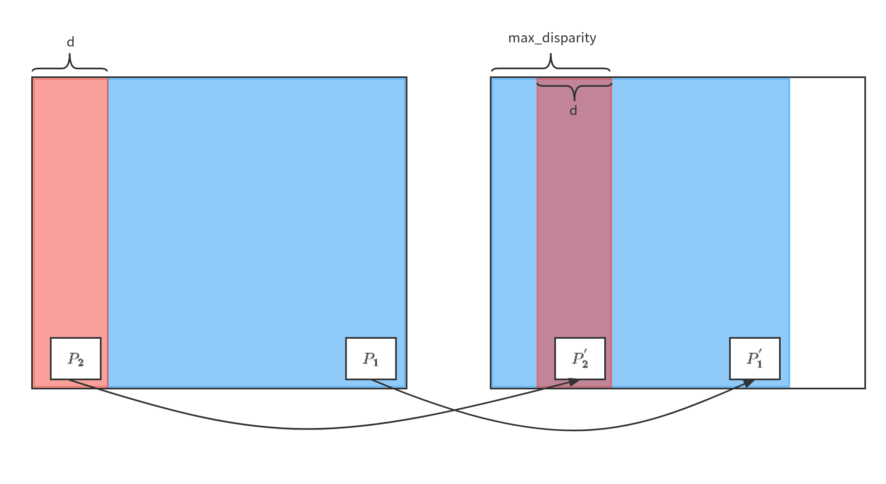
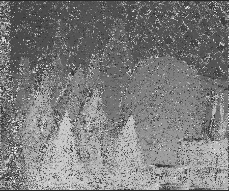
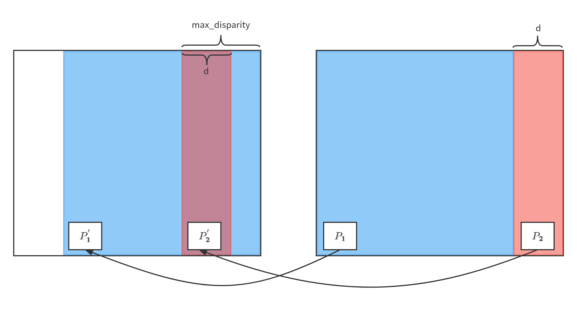
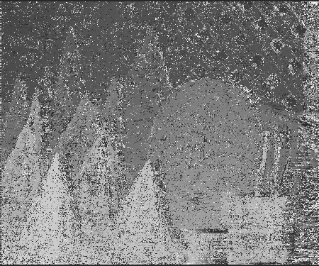
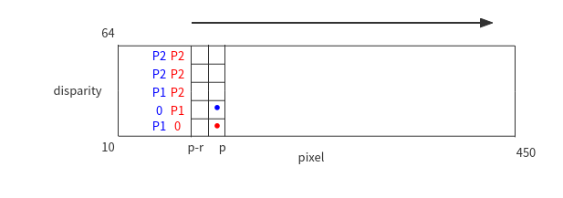
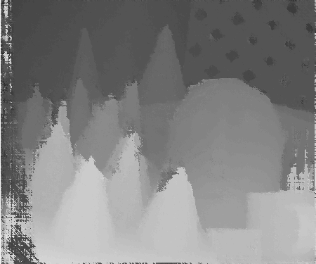
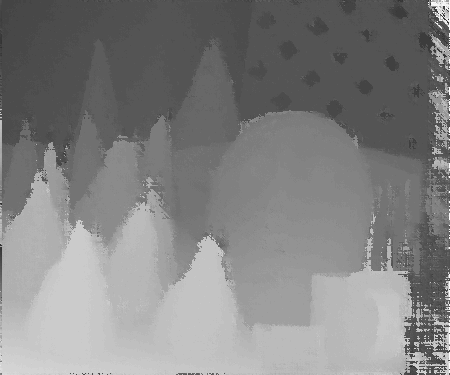
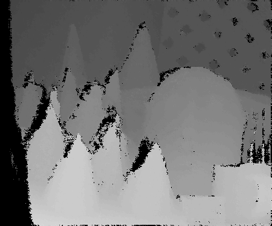
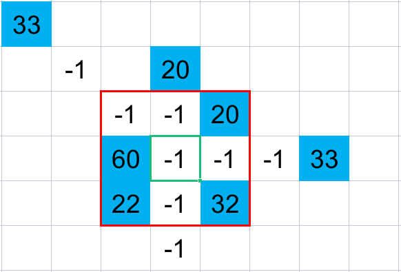
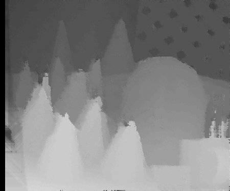

#### 源码位置：./src/sgm/

### Census变换

首先设定一个奇数大小的窗口，如 5x5 ，然后做类似于卷积的运算，遍历整张图像。遍历时，将窗口中除中心像素外的每个像素的灰度值与中心像素的灰度值进行比较，若灰度值小于中心像素记为 $0$ ，大于或等于中心像素记为 $1$ ，按顺序排列之后就得到了由 $0$ 和 $1$ 组成的二进制，在存储 $census$ 矩阵 $(w,h)$ 时，需要将其转换成十进制。

$$
\begin{bmatrix}
    1&2&3&4&5\\
    1&2&3&4&5\\
    1&2&3&4&5\\
    1&2&3&4&5\\
    1&2&3&4&5
\end{bmatrix}
->
\begin{bmatrix}
    0&0&1&1&1\\
    0&0&1&1&1\\
    0&0&x&1&1\\
    0&0&1&1&1\\
    0&0&1&1&1
\end{bmatrix}
->001110011100110011100111->3788007
$$

### 代价计算

在计算代价矩阵时，需要先假设一个视差值$d$，然后求左图中的某个像素 $p$ 对应右图中 $p-d$ 的 $Hamming距离$ 。因此，需要先设定最小视差 $min\\_disparity$ 和最大视差 $max\\_disparity$ ，然后从视差 $min\\_disparity$ 遍历计算到 $max\\_disparity$ 。则对于 $shape$ 为 $(width,height)$ 的图像，可以得到 $(height,width,max\\_disparity-min\\_disparity)$ 的代价矩阵。

其中， $Hamming距离$ 指的是两个 $census$ 序列之间的相似度。度量方式为两个字符串对应位置的不同字符的个数。如 $110111$ 和 $101001$ 之间的 $Hamming距离$ 为 $4$ 。

假定视差为 $d$ ,在右图中寻找左图对应的像素点 $p$ 时的规则如下：

 

$$
p^{left}=
\begin{cases}
    p^{right}-d & p^{right}>d\\
    max\\_disparity-d+p^{right} & p^{right}\leq d
\end{cases}
$$

得到左图的代价矩阵，对其进行可视化如下图所示：

 

同理，假定视差为 $d$ ,在左图中寻找右图对应的像素点 $p$ 时的规则如下：

 

$$
p^{right}=
\begin{cases}
    p^{left}+d & p^{left}+d<{width}\\
    {width}-max\\_disparity+(p^{left}-({width}-d))=d+p^{left}-max\\_disparity & p^{left}+d\geq {width}
\end{cases}
$$

得到右图的代价矩阵，对其进行可视化如下图所示：

 

### 代价聚合

代价聚合的根本目的是让代价值能够准确的反映像素之间的相关性。上一步匹配代价的计算往往只会考虑局部信息，通过两个像素邻域内一定大小的窗口内的像素信息来计算代价值，这很容易受到影像噪声的影响，而且当影像处于弱纹理或重复纹理区域，这个代价值极有可能无法准确的反映像素之间的相关性，直接表现就是真实同名点的代价值非最小。

而代价聚合则是建立邻接像素之间的联系，以一定的准则，如相邻像素应该具有连续的视差值，来对代价矩阵进行优化，这种优化往往是全局的，每个像素在某个视差下的新代价值都会根据其相邻像素在同一视差值或者附近视差值下的代价值来重新计算，得到新的代价矩阵。

路径代价：

$$
L_r(p,d)=C(p,d)+min\begin{bmatrix}
    L_r(p-r,d)\\
    L_r(p-r,d-1)+P_1\\
    L_r(p-r,d+1)+P_1\\
    min_iL_r(p-r,i)+P_2
\end{bmatrix}
-\underset {k}{min}L_r(p-r,k)
$$

>1）$r$ 代表路径方向; $p$ 为当前像素，$p−r$ 为前一个像素；

>2）第一项 $C(p,d)$ 表示像素 $p$ 的初始匹配代价；

>3）第二项 $min[]$ 表示 $p−r$ 的最小匹配代价：

>>3.1）若 $p−r$ 和 $p$ 的视差差值为 0，不做惩罚。

>>3.2）若 $p−r$ 和 $p$ 的视差差值为 1，加惩罚因子 $P1$;

>>3.3）若 $p−r$ 和 $p$ 的视差差值大于 1，则惩罚因子为 $P2$；

>4）第三项 $\underset {k}{min}L_r(p-r,k)$ 表示 $p−r$ 沿 $r$ 路径上的最小匹配代价。

方向包含：上，下，左，右，左上，左下，右上，右下 总共8个方向

$$
\begin{matrix}
    ↘&↓&↙\\
    →&p&←\\
    ↗&↑&↖
\end{matrix}
$$

例如：当向右聚合时，对于 $shape$ 为 $(height,width,max\\_disparity-min\\_disparity)$ 的 $cost\\_volume$，需要遍历高度 $height$，对于每一个高度，得到 $shape$ 为 $(width,max\\_disparity-min\\_disparity)$ 的路径 $cost\\_volume$ 矩阵，再执行上述 $L_r(p,d)$ 计算。为了便于描述，这里假设 $w=450,min\\_disparity=10,max\\_disparity=64$ ，如下图所示：

对于像素p：

>第一项 $C(p,d)$ 为在 $p$ 处的64个视差的 $cost_volume$ ， $shape$ 为 $(64,1)$

>第三项 $\underset {k}{min}L_r(p-r,k)$ 为 $p-r$ 处的 $64$ 个视差的 $cost_volume$ 的最小值， $shape$ 为 $(1,1)$

>第二项 $min[]$ 的计算为：

>>1）对于 $p$ 在 $0$ 视差(红点)位置，相对于 $p-r$ 的各个视差的 不同视差差值下的匹配代价，对于该元素，其惩罚系数分别为 $0,P_1,P_2,P_2,P_2...$ 。并取最小值。

>>2）对于 $p$ 在 $1$ 视差(蓝点)位置，相对于 $p-r$ 的各个视差的 不同视差差值下的匹配代价，对于该元素，其惩罚系数分别为 $P_1,0,P_1,P_2,P_2...$ 。并取最小值。

>>3）依次类推...，就得到了 $shape$ 为 $(64,1)$ 的第二项。

### 视差计算
由聚合后的代价求解视差时，一般采用“赢家通吃算法”，即取最小代价值的index作为该像素的视差值。
 $(height,width,max\\_disparity-min\\_disparity,8)->(height,widht,max\\_disparity-min\\_disparity)->(height,width)$

即可分别得到左视差和右视差：

### 左右一致性检验
左右一致性检验是基于视差的唯一性限制，基本原理是从交换左图像和右图像。 此时，如果再次重新开始立体匹配，则获得新的左图像(原始右图像)的视差图。 此时，比较左右图像同一像素点的视差，观察视差是否一致，如果一致则满足一致检查，如果不一致则标记该点，具体做法为：
根据左右视差图。对于左图中的一个点 $p$ 及其视差值 $d_l$ ，由视差的公式 $d = x_l - x_r$ 可得点p对应在右图中的位置为 $p-d$ ，然后从右图中索引出 $p-d$ 的视差 $d_r$ 。若 $d_l$ 和 $d_r$ 的差值大于某个阈值 $threshold$ ，则认为 $p$ 为遮挡点。

左右一致性检验结果如下：

### 空洞填充
在上述左右一致性检查之后，会出现一些没有视差值的像素区域，对于这些没有视差的像素，需要利用周围的视差进行填充。空洞视差填充的方法有很多，这里提供一种思路：
1）对于某个没有视差值的像素，首先观察其8邻域范围内的视差值。
2）若8领域的视差均为有效值，则使用8领域的视差的均值作为该点的视差。
3）若某方向上的视差也是无效视差，则沿着该方向继续寻找有效视差，直至找到有效视差或超出图像范围。

例如，对于如下8x6的图像:

其用于填充的中间绿色像素的视差值为 [33,20,20,33,32,22,60] 这7个值的均值。
空洞填充结果如下：

### 中值滤波

